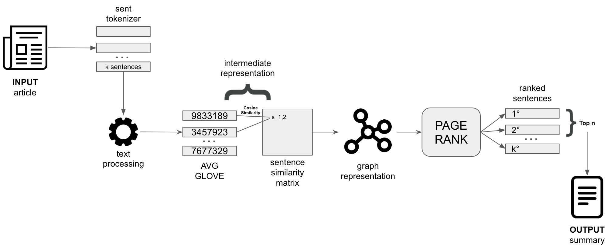

# Extractive summarization: TextRank implementation

In this repo you will find the code used to implement the TextRank algorithm:

- This code is related to my Medium post [LINK](https://medium.com/@fabiosalern/decomposing-the-textrank-algorithm-to-grasp-the-main-idea-behind-it-code-implementation-b29414eba821)
- Where step by step I exploit the code implementation to give a better understanding of the Text Rank algorithm.
- My goal is trying to give a better understanding of extractive summarization techniques through a code implementation. Already exists several libraries where the Text Rank algorithm is already implemented (like `sumy`). However the aim of this repo is just making deep dive on the implementation for gaining deeper understanding of what this kind of algorithms do under the hood.

For readability reasons I have presented the code through a Jupyter notebook, however in the future I am planning to create an API where everyone can use my implementation by just calling the functions.

I hope this repo can be helpful to you, cheers Fabio!

